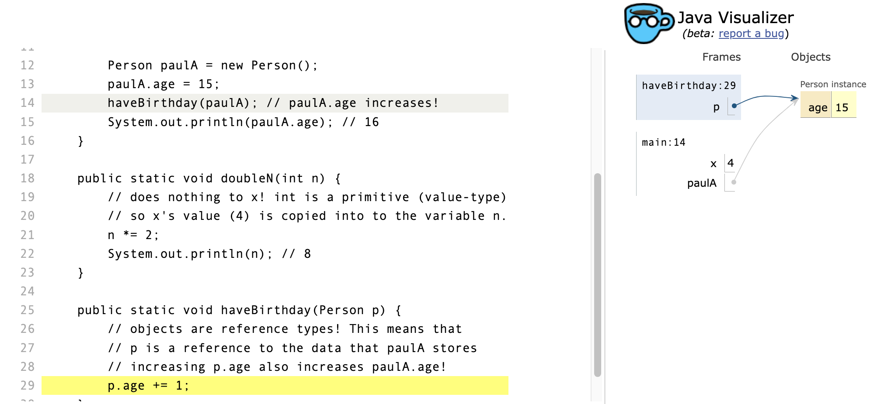
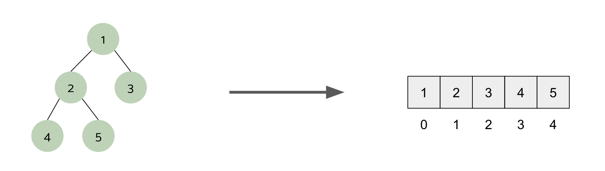
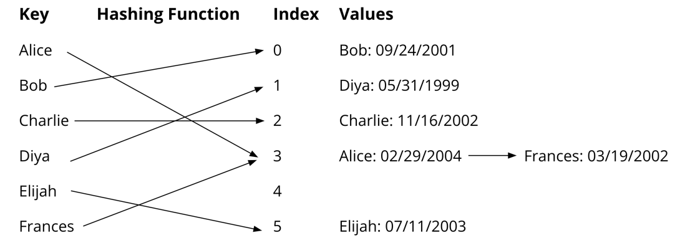
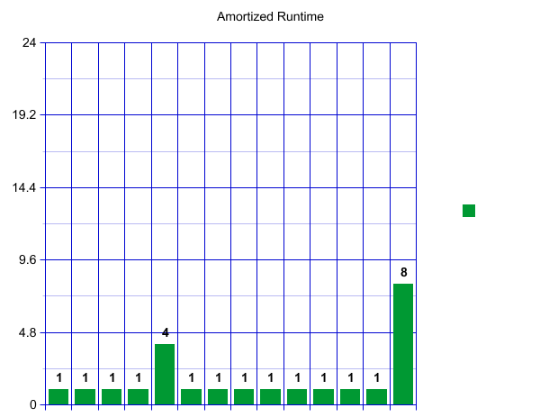
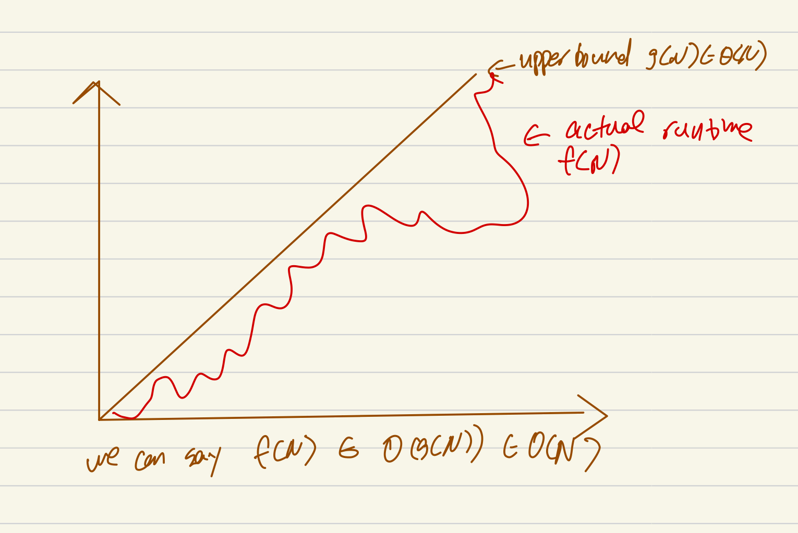
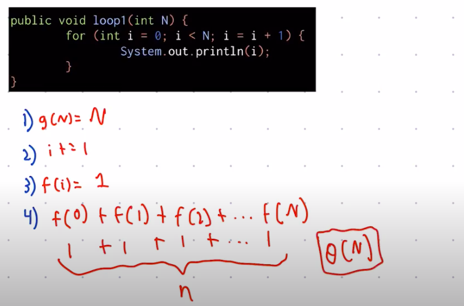
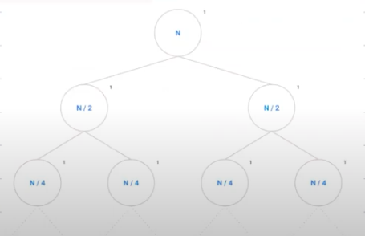

# SU22 *Unofficial* Study Guide

> **This is a non-comprehensive review of course topics! Please be sure to do your own studying in addition to using this guide. Contents of the guide were created by flawed, error-prone humans, and may be incorrect! Please use your good judgement when applying the guide.**

## Note to Reader

In this guide, types and classes are synonyms, and instances and objects are synonyms.
This follows the common pattern of speech that an instance of a class is an object of type "Class".

## Java Concepts

### Primitives & Objects

In many languages, there are two categories of data: *value types* and *reference types*.
In Java, these categories map directly to *primitives* and *objects*, respectively.

The 8 primitives are:
- The integer types (in increasing order of #-of-possible-values): `byte`, `short`, `int` and `long`
- The floating-point (numbers with decimals) types (in increasing order of precision): `float` and `double`
- The `char` type that holds one Unicode character
- The `boolean` type that holds `true` or `false`

When you pass data to a function `method(x)` or use `x.method()`...
> value types will be **copied and not modified in the original context**

> reference types which pass a *reference to the original value*, allowing the function to **modify the original value**. 

Note that *all primitives have no methods*. 
Any expression of the form `x.method()` implies that `x` is an object (reference type), which makes `method` capable of editing the values referenced by `x`, e.g.
``` java
public class Person {
    public String name;
    public int age;
}

public class ReferenceExample {
    public static void main(String[] args) {
        int x = 4;
        System.out.println(x); // 4
        doubleN(x);
        System.out.println(x); // 4

        Person paulA = new Person();
        paulA.age = 15;
        haveBirthday(paulA); // paulA.age increases!
        System.out.println(paulA.age); // 16
    }

    public static void doubleN(int n) { 
        // does nothing to x! int is a primitive (value type)
        // so x's value (4) is copied into to the variable n.
        n *= 2;
        System.out.println(n); // 8
    }

    public static void haveBirthday(Person p) {
        // objects are reference types! This means that
        // p is a reference to the data that paulA stores
        // increasing p.age also increases paulA.age!
        p.age += 1;
    }
}
```

#### Box-and-Pointer Diagrams

We use box-and-pointer diagrams to depict the current state of references and values in Java code.
It makes explicit which data is value type (written inside a box) and which is reference type (pointed to from a box).
The code above has the following box-and-pointer diagram while executing `haveBirthday(paulA)`.



Note how both variables `p` in the `haveBirthday` frame and `paulA` in the `main` frame point to the same "`Person` Instance" box - this is because they both reference the same data!
Modification through one reference (as on line 29) will change the value behind all others!


#### `==` vs `equals`

Primitives (value types) must use the `==` operator.
Objects (reference types) should nearly always use `a.equals(b)`.
The expression `a == b` compares if the bitwise value of the references are exactly equal, and **always ignores the contents of the data behind the references**.
Be very careful to use the right equality operator for the right type.
For more information on comparison, see the [comparison](#comparison) section.

#### Type Defaults

When declared but not assigned to:

- Value types are set to `0`, `false`, or the zero character.
- Reference types are set to `null`.

Using `.` after a `null` value or trying to cast it will cause a `NullPointerException`.
`null` is only ever `==` to `null` (and will never err when compared with `==`).
Attempting to call `x.equals(y)` will throw an exception if `x` is null, but may not if `y` is null depending on the implementation of `equals()`.

#### Primitive Wrapper Types

Every primitive has it's UpperCamelCase wrapper type.

| `byte` | `short` | `int` | `long` | `char` | `float` | `double` |
|----|---|---|---|---|---|---|
| `Byte` | `Short` | `Int` | `Long` | `Char` | `Float` | `Double` |

Though it is a reference type, we draw it as a primitive in box-and-pointer diagrams.
It can be used for a primitive type through *implicit down-casting*, eg
``` java
Double d = 7.5;
double circumference = d * Math.PI;
//                    ^ Java automatically makes d a double here,
//                      so it will type check.
```

**Because it is a reference type, it can be null, and will throw a NullPointerException if it is down-cast or a method is called from it!** 
Whenever the guide says an operation can only be done with primitives, this includes implicitly down-casted wrapper instances.

### Operators

#### Numeric Operators

These can be used with the [8 primitive types](#primitives--objects).

| Operator | Return type | Description |
|---|---|---|
| `+` `-` `*` `%` | same as inputs | Add, subtract, multiply, modulo (remainder) |
| `int / int` | `int` | Integer division (floored - `8 / 3 == 2`) |
| otherwise `/` | same as most precise input | Standard floating point division (`8.0 / 3.0 == 2.66`) |
| `==` `!=` | `bool` | primitive equality checks ([not for use with objects](#vs-equals)) |
| `>` `>=` `<=` `<` | `bool` | primitive inequality checks |


All arithmetic operators have their "update-by-operation" equivalents: `+=`, `*=`, `-=`, `/=`, `%=`, etc, that must be used with a variable eg
``` java
double d = 6.0;
d /= 2.0;
System.out.println(d); // 3.0
```

There are two special operators for numeric primitives: `++` and `--` which are equivalent to `+= 1` and `-= 1`, respectively.

#### Reference Operators

The most important operator is dot: `.`.
It allows us to access methods and variables inside of objects and classes, as well as packages and classes inside other packages.

Another operator is the array operator: `[]`.
It can be used for constructing arrays ([see this section](#arrays)) or zero-indexing into them, eg `people[3]` would get the 4th element of the array.

A rare operator is varargs: `T...`.
It can only be used inside a list of parameters and allows callers of the [method](#methods-functions) to provide any number of arguments of type `T`.
Objects of type `T...` are actually `T[]` behind the scenes.
One notable example is that the canonical main method in Java is written:
``` java
public class OldMain {
    public static void main(String... args) {
        System.out.println(String.join(", ", args));
    }
}
```
This reflects the ability to call programs from command-line like so:
```
$ java OldMain --hi 3 --there "Paul Atreides"
--hi, 3, --there, Paul Atreides
```

### Conditionals

If statements allow us to make decisions in code:
``` java
if (cloudCover > 0.8) {
    bringUmbrella = true;
}
```
Switch and else are just syntax sugar for other ifs.

Conditionals done.

What you want more? Okay...

Else blocks can optionally be provided, and mutually exclusive ifs can be chained in the elses:
``` java
if (cloudCover > 0.8) {
    bringUmbrella = true
} else if (uvIndex > 10) {
    applySunscreen();
} else {
    System.out.println("Yay - Good Weather!");
}
```

In this example, either we will have an umbrella, put on sunscreen, or praise the weather.
If you know your skin-care though, you know you may need to apply sunscreen even when there's a good deal of clouds in the sky.
Omitting the else allows for both umbrella and sunscreen, but loses the logic for praise.
``` java
if (cloudCover > 0.8) {
    bringUmbrella = true
}

if (uvIndex > 10) {
    applySunscreen();
}
```

Switch blocks allow for quickly doing many equality checks to primitive and String literals.
For example, 
``` java
public static String emote(char dayOfTheWeek) {
    switch (dayOfTheWeek) {
        case 'M':
            return "*incoherent zombie noises*";
        case 'W':
            return "Whoa~~ half way there~~";
        case 'T':
        case 'R':
            return "Are we there yet?";
        case 'F':
            System.out.println("TGIF");
            // no return: early weekend excitement ok!
        default: 
            return "Yay Weekend!";
    }
}
```

The `default` keyword is the `else` equivalent for `switch`.
It may be omitted if you don't want a catch-all-case.
The example compares a `char` to 'M', 'T', 'W', 'R', 'F', and if it doesn't match any, assumes it's the weekend (**bug!?**).
Note that we can list multiple cases (eg 'T' and 'R') and they will execute the same body (eg "Are we there yet?").

If we don't return, break, or otherwise change control-flow at the end, the case will *fall-through* in line order. 
In the example, the `F` case will print TGIF and then return "Yay Weekend!" because there's no return/break after the print.
That said, fall-through is usually a mistake. 
When it's purposeful, *add a comment highlighting why fall-through is okay*, as in the example.

### Loops

#### `while` loops

While loops take the form
``` java
while (/* condition */) {
    // body...
}
```

- The condition must be a boolean expression, and is evaluated before every loop iteration. 
If the condition evaluates as false (including before the first iteration), the body is skipped and the loop ends.
- The body may be empty, but should almost never be

A classic example of a while loop is when using the `Iterator<T>` construct.

``` java
public static void printNums(List<Integer> nums) {
    Iterator<Integer> iter = nums.iterator();
    while (iter.hasNext()) {
        Integer n = iter.next();
        System.out.print(n);
    }
}
```

#### C-Style `for` loops

C-Style loops take the form:
``` java
for (/* initializer */; /* condition */; /* update */) {
    // body...
}
```

Any or all of the initializer, condition, update, and body can be empty (as above), but leaving them empty is generally considered bad style and a while loop should be used instead.
- The initializer must be a statement, and is executed once when the loop begins.
- The condition must be a boolean expression, and is evaluated before the start of every iteration.
If the condition evaluates as false (including before the first iteration), the body is skipped and the loop ends.
- Multiple expressions are allowed for the update, and they are evaluated at the end of every iteration (before the condition is evaluated at the start of the next iteration).

A classic example is to iterate over an array:

``` java
public static void zeroMyHero(int[] myHero) {
    for (int i = 0; i < myHero.length; i++) { // initializer (int i = 0) run here 
        // condition (i < myHero.length) checked here
        myHero[i] = 0; // i only defined in body
        // update (i++) evaluates here
    }
    // i not defined in this scope
}
```

#### `for`-each loops

For each loops take the form
``` java
for (Type itemName : itemsIterable) {
    // body...
}
```

- `Type` can be any Object or primitive type.
- `itemsIterable` must implement `Iterable<Type>` (must be the wrapper type if iterating over primitive, eg `Integer` for `int`)
- `itemName` can be any valid variable name.
- `body` can be empty, but should never be.

This loop makes it easier to read from collections, but **can never be used to modify them**.
For example `zeroMyHero` cannot be written with a for-each loop because it modifies the array it's iterating over, but `printNums` can, because `List<Integer>` implements `Iterable<Integer>`.
``` java
public static void printNums(List<Integer> nums) {
    // int n : nums also works as long as no elements are null!
    for (Integer n : nums) { 
        System.out.print(n);
    }
}
```


### Instance Variables, Constructors, and `this`

Classes are often used as templates for data, allowing us to store related data together.
The way we indicate that all instances of the class have certain data is with *instance variables*, like `name` and `age` on `Person`:
``` java
public class Person {
    public String name;
    public int age;
}
```

This means if a variable is declared `Person p`, then `p` has `p.name` and `p.age`.
It is often useful to assign values to these variables when we first make an instance of an object (say a new Person).
For example, it would be convenient to specify the values of these variables when we create a new person object, like so:
``` java
public class InstanceVariablesExample {
    public static void main(String[] args) {
        Person sonOfDracula = new Person("Alucard Fahrenheit Tepes", 19);
        System.out.println(sonOfDracula.name); // Alucard Fahrenheit Tepes
        System.out.println(sonOfDracula.age);  // 19
    }
}
```

We do this using constructors, for example a good Person constructor is:
``` java
public class Person {
    public String name; /* A */
    public int age;

    public Person(String name /* B */, int age) {
        this.name /* C */ = name; 
        this.age = age
    }
}
```

Note the use of `this.name` in location `C`.
We use `this` to specify that we are referencing the `name` instance variable at `A`.
We omit `this` to indicate that we want the parameter `name` at `B`.

In general `this` refers to the instance of the object "we are currently inside of."
In other words, when you call `x.method()`, `this` refers to `x`.
When calling a constructor like so:
``` java
Person sonOfDracula = new Person("Alucard Fahrenheit Tepes", 19);
```
...the value of `this` at `C` is `sonOfDracula`.

We do not always need to include this when it is clear which variable we are referencing. 
**It is bad practice to use `this` when it is not necessary.**
Below is an example of when there is no ambiguity, and `this` should be dropped:
``` java
public class Person {
    public String name;
    public int age;
    
    public Person(String name, int age) { /* details omitted */ }

    public String introduction() {
        return "Hello, my name is " + name + ". I'm " + age + "!";
    }
}
```

### Variables

In Java, all variables must be declared.
Before they can be used they must be initialized (assigned to for the first time).
When being initialized, almost all reference types are filled with a new instance of an object, which must be constructed.
Java helpfully allows us to do all these steps in one statement:

#### *Anatomie of an Declaration and Assignment*


If the variable is [`final`](#the-static-and-final-keywords) (as my favorite cake would be), the `final` keyword comes before the type in the declaration.
If the variable is not a local variable (inside a method body), then [`static`](#the-static-and-final-keywords) and a [visibility modifier](#visibility-modifiers-getters-and-setters) may proceed the rest of the declaration.
Therefore, a constant in Java takes the form:
``` java
public class LifeTheUniverseAndEverything {
    // unchangeable, universal, constant.
    public static final int MEANING = 42;
}
```

As seen in both examples, constructors (and the `new` keyword) aren't used for value literals (`"hi"` for String, `'\n'` for `char`, `{ 3, 5, 7 }` for `int[]`).

### Methods (Functions)

In Java, all functions are methods.
All methods belong to a class.
All methods have a signature:

```
|-1--| |-2--| |3-| |-4-----| |5-| 6  |-5-| 6
public static void haveLunch(Food f, Drink d)
```

1. Visibility modifier (in ascending order of access): `private`, `protected`, *none*, `public`
2. `static` modifier (may be omitted for instance methods)
3. Return type: any type or `void` which returns nothing
4. Method name
5. Parameter types: any type
6. Parameter names: any valid name (must be unique in this signature)

After the signature comes the method body, between braces.
Any valid series of statements can make a body (including none).


#### Visibility Modifiers, Getters, and Setters

Oftentimes we don't want people to be able to reach inside our class and change our instance variables, or to know the data exists at all!

We can mark variables and methods as `private` instead of `public` to prevent people from being able to see our sensitive data:
``` java
public class CreditCard {
    private Date expiry;
    private long number;
}
```

This way no one can modify this information - but no one can read it either.
We can add *getters* for the appropriate information:
``` java
public class CreditCard {
    private Date expiry;
    private long number;

    public Date getExpiry() {
        return expiry;
    }

    public long getNumber() {
        return number;
    }
}
```

Note that getters always have a consistent format:
``` java
    public Type getInstanceVar() {
        return instanceVar;
    }
```

Say we want to allow for renewals of our card, so we want users of the class to be able to set the `expiry` variable.
We use a very similar template for *setters*.
``` java
    public void setExpiry(Date newExpiry) {
        expiry = newExpiry;
    }
```

Note that setters must always return `void`.

### The `static` and `final` Keywords

> *`static` variables and methods are universal to all instances of a type (or conversely, not dependent on any single instance).*

For example, consider a bakery making cakes.
They have a `Cake` class that has all the relevant pastry details for the register.
At the end of the day the register shuts down after many delicious transactions.
The manager wants to know how many cakes are made in a day, and so they add this code that tracks how many `Cake` instances have been sold:

``` java
public class Cake {
    public static int cakesMade = 0;
    
    public String flavor;
    
    public Cake(String flavor) {
        this.flavor = flavor;
        cakesMade++;
    }

    public static void feedTheStaff() {
        Cake c = new Cake("Pineapple-Upside-Down");
        c.eat();
    }

    // other methods...
}
```
``` java
public class Register {
    public static void main(String[] args) {
        Cake[] cakeCabinet = new Cake[] {
            new Cake("German Chocolate"),   // cakesMade++!
            new Cake("Carrot"),             // cakesMade++!
            new Cake("Crazy Lemon"),        // cakesMade++!
        };
        // start the day off right
        Cake.feedTheStaff();                // cakesMade++;

        // do all the register-y stuff...

        // Closing time!
        // Cakes made today:
        System.out.println(Cake.cakesMade); // 4
    }
}
```

Some things to note:
- The value of `cakesMade` persists until the program ends (at the end of `main`) - no instance of anything required.
- `cakesMade` and `feedTheStaff()` are accessible directly through the `Cake` class - *no instance required!*
- Even though the instance of Cake `c` in `feedTheStaff()` is lost and destroyed at the end of the method, the `cakesMade` variable remains incremented - **no instance required!**

> *`final` simply allows us to make primitives and references to objects immutable.*

This is a subtle definition - it means that the values of primitives can't change, and the **arrows to objects can't change, but underlying data can!**
For example:

``` java
public class MagicCake {
    public static void main(String[] args) {
        final int answer = 42;

        // not allowed. changes value of primitive (value type)
        // answer = -1;
        // answer += 8;

        final Cake c = new Cake("One Flavor");

        // not allowed. Draws a new arrow to a new Cake object.
        // c = new Cake("A Worse Flavor");

        // allowed! the arrow c represents stays the same.
        // the underlying variables can still change.
        c.flavor = "A Worse Flavor";
    }
}
```

In our example, to prevent this behavior from being possible, the instance variable flavor should either be made `private` with no setters, or `final`.
In either case, it will prevent cakes from magically changing flavor after we make them (assumably a bad thing).

A good way we can fix this is by making the `flavor` variable of `Cake` final as well!
``` java
public class Cake {
    public static int cakesMade = 0;
    
    public final String flavor;
    
    public Cake(String flavor) {
        this.flavor = flavor;
        cakesMade++;
    }

    // other methods...
}
```

Now assigning to `c.flavor` (or any other Cake instance) is not allowed!
**Note: all final instance variables *must* be assigned in the constructor, or the class will not compile.**

### Testing

> Test-Driven Development (TDD) is the coding practice in which a programmer begins solving a task by writing all relevant unit and integration tests, then writing code that passes those tests.

By ordering it in this way, we prevent ourselves from using any "insider's information" about the solution.
We only have a reasonable expectation of how the solution should perform.
From this expectation we write a full-spec of tests.

In this class, we use JUnit 4 as our test suite. 
It provides several useful methods:


| method                                                                        | description                                                                                                                                  |
|-------------------------------------------------------------------------------|----------------------------------------------------------------------------------------------------------------------------------------------|
| [`void assertTrue (boolean condition);`][assertTrueBool]                      | If `assertTrue`'s condition evaluates to false, then the test fails.                                                                         |
| [`void assertTrue (String errMsg, boolean condition);`][assertTrueStringBool] | Like `assertTrue`, but if it fails, it prints a provided error message. Nearly all assertions have a version that accepts an error message.  |
| [`void assertNull (Object obj);`][assertNull]                                 | If `assertNull`'s argument isn't `null`, the test fails. An error message may also be supplied.                                              |
| [`void assertNotNull(Object obj);`][assertNotNull]                            | Fails for a `null` argument. An error message may be supplied.                                                                               |
| [`void assertEquals (Object expected, Object actual);`][assertEquals]         | `assertEquals` succeeds when `expect.equals(actual)`. For primitives, it checks `expected == actual`. An error message may also be supplied. `assertNotEquals` also available. |
| [`void assertSame (Object expected, Object actual);`][assertSame]         | `assertSame` succeeds when `expect == actual` and so does not check for data equality. To be used with caution! An error message may also be supplied. `assertNotSame` also available. |
| [`void fail();`][fail]                                                        | If this method is called, the test fails. An error message may be supplied.                                                                  |

[assertTrueBool]: <https://junit.org/junit4/javadoc/latest/org/junit/Assert.html#assertTrue(boolean)>
[assertTrueStringBool]: <https://junit.org/junit4/javadoc/latest/org/junit/Assert.html#assertTrue(java.lang.String,%20boolean>
[assertNull]: <https://junit.org/junit4/javadoc/latest/org/junit/Assert.html#assertNull(java.lang.Object)>
[assertNotNull]: <https://junit.org/junit4/javadoc/latest/org/junit/Assert.html#assertNotNull(java.lang.Object)>
[assertEquals]: <https://junit.org/junit4/javadoc/latest/org/junit/Assert.html#assertEquals(java.lang.Object,%20java.lang.Object)>
[assertSame]: <https://junit.org/junit4/javadoc/latest/org/junit/Assert.html#assertSame(java.lang.Object,%20java.lang.Object)>
[fail]: <https://junit.org/junit4/javadoc/latest/org/junit/Assert.html#fail()>

You can find more JUnit methods in their
[docs](https://junit.org/junit4/javadoc/latest/org/junit/Assert.html).

This chart was modified from [lab04 spec](https://cs61bl.org/su22/labs/lab04/#junit-framework)

### Generics

#### Arrays

The `[]` are the [operator](#operators) for making arrays.
When used following a primitive or reference type, it creates a new type, eg `int[]` is an "int array", and a `Person[]` is a "Person array", or colloquially an "array of people."
When used as a constructor, it requires a length:
``` java
int nums = new int[27];
System.out.println(nums.length); // 27
```

It populates the array with the type's default.

When used after an array variable, it gets the zero-indexed item of the list.
As a result, the length is always out of bounds.
``` java
nums[2] = 7; // the third item
System.out.println(nums[0]); // the default
nums[27]; // IndexOutOfBoundsException! 
```

#### Custom

> Generics allow us to parameterize types by other types.

Like parameters to methods, it allows us to have variables, but unlike methods, these are type variables!

For example, we always want linked lists of *something*.
We want to add *something*s, remove *somethings*, and insert *somethings* at an index.
That *something* is the type is the generic type:
``` java
public class LinkedList<Something> {
    public void add(Something item);
    public boolean remove(Something item);
    public void add(int index, Something item);
}
```

The name *something* is uninformative and cumbersome.
"Element" is more apt, but still cumbersome.
Let's abbreviate to `E` instead:
``` java
public class LinkedList<E> {
    public void add(E item);
    public boolean remove(E item);
    public void add(int index, E item);
}
```

Then when we go to use it with `Person`s for example, we provide the type parameter `Person` in between the angle brackets:
``` java
LinkedList<Person> congaLine = new LinkedList<Person>();
//       we can optionally omit the type here ^^^^^^
//       Java just figures it out.
```

Generics can also be used for [interfaces](#adts-interfaces):
``` java
public interface Comparable<T> {
    int compareTo(T other);
}
```

This is useful if you're, say, writing a bunch of things that hold other things.
Some limitations to be aware of:
- You can only pass class names as type parameters, not primitives
    - But you can use their wrapper types!
- You cannot create an array of a type variable, so `new E[17]` would not compile, even though you **can** declare `E[] seventeenEs` as a variable.
- You can use `extends` and `implements` to put constraints on the types that can be used in this generic.
For example, trees operate by comparing their elements.
As a result, their `E`s need to implement the `Comparable<E>` interface. 
The class declaration looks like:
    ``` java
    public class TreeSet<E implements Comparable<E>> // ...
    ```

It is also possible, though exceedingly rare, to have a method have its own type parameters.
Consider this method for getting the greatest element in a slice of a list of `T`s.
``` java
public class ListUtils {
    public static <T implements Comparable<T>> T maxInSlice(List<T> input, int start, int end) {
        T out = input.get(start);
        for (int i = start + 1; i < end; i++) {
            T item = input.get(i);
            if (out.compareTo(item) < 0) {
                out = item;
            }
        }
        return out;
    }
}
```

Between the `static` modifier and the return type `T`, we have the angle brackets!
Just like in the `TreeSet` example, we can specify that the type is comparable (and we have to in order to figure out which is the maximum).
The rest of the method proceeds like normal: name, parameter list, and body.
In use, it looks identical to how one might want it to look:
``` java
Integer[] numArray = { 3, 4, 9, 0, 6, -1, 7, 12 };
List<Integer> nums = new ArrayList<>(numArray);
int max = ListUtils.maxInSlice(nums, 3, 7);
System.out.println(max); // 6
```

### ADTs (Interfaces)

An Abstract Data Type is a definition for a set of behaviors that a class must implement in order to be considered a member of that ADT.
In Java, this is formalized with an `interface`.

A common example is the Set ADT.

``` java
public interface Set<E> {
    void add(E item);
    void remove(E item);
    boolean contains(E item);
    int size();
}
```

Note that interfaces do not require implementations of the methods, only (most of) their signatures (return type, name, and parameter list).

Visibility modifiers are not necessary because if the methods weren't public, then nobody could use them which would make them pointless as an ADT.
All methods in an interface (when implemented) will be public.
Furthermore all interface methods are instance (not static).
Interfaces are meant to describe the behavior of an *object*, not a class.

Occasionally, it is useful to define reasonable default behavior in an interface such as
``` java
public interface Set<E> {
    // add, remove, contains, size...

    // a reasonable default that could have 
    // faster class-specific implementation
    default boolean isEmpty() {
        return size() == 0; 
    }
}
```

``` java
public interface Palette {
    void addColor(Color c);    
    default void addColor(int r, int g, int b) {
        addColor(new Color(r, g, b)); // convenient!
    }
}
```

Default methods are defined with the `default` keyword.
Like the others, default methods can be overridden in subclasses, but unlike the others, subclasses don't *have* to override.

### Inheritance

> If a class `A` implements an interface `B` or extends a class `C`, it is said to be a **subtype** (or **subclass**) of `B` and `C`.

#### Implementing Interfaces

> `implements` allows us to declare that a class is a subtype of an interface (and it conforms to the ADT the interface defines).

Good examples are the various `List<E>` implementations:
``` java
public interface List<E> {
    public void add(E item);
    public E get(int index);
    // more...
}
```
``` java
public class ArrayList<E> implements List<E> {
    private E[] data;
    private int startIndex, stopIndex;
    // more variables, constructors...

    @Override
    public void add(E item) {
        // implementation skipped...
    }

    @Override
    public E get(int index) {
        // implementation skipped...
    }

    // more overrides...
}
```
``` java
public class LinkedList<E> implements List<E> {
    private class Node {
        private E data;
        private Node next, prev;
        // constructors, methods...
    } 
    
    private Node sentinel;
    // more variables, constructors...

    @Override
    public void add(E item) {
        // implementation skipped...
    }

    @Override
    public E get(int index) {
        // implementation skipped...
    }

    // more overrides...
}
```

Both `ArrayList<E>` and `LinkedList<E>` are `List<E>`s - they override all methods listed in the interface, and are declared as `implements List<E>`.
That is all that is required!
To use them, we can say:
``` java
List<Integer>[] lists = {
    new ArrayList<>(),  // ArrayList is-a List
    new LinkedList<>(), // LinkedList is-a List
};
```

Note that these are a more specific type of `List` at runtime than the `List<Integer>` they are declared as when Java does compile-time type-checking.

> *Polymorphism* allows for the runtime type to be a subtype of the compile-time type. **Inheritance enables polymorphism.**

#### Subclasses and Casting

> `extends` allows us to declare one type as a subtype of another, ie form an "is-a" relationship.

If I have a `Dog`:
``` java
public class Dog {
    public final String name;

    public Dog(String name) {
        this.name = name;
    }

    public void shake() {
        System.out.print("Shakes hand: ");
        System.out.println(introduce());
    }

    protected String introduce() {
        return "HI! I'M " + name.toUpperCase() + "!";
    }
}
```

And a class that extends it, `Greyhound`, which overrides `introduce`:
``` java
public class Greyhound extends Dog {
    @Override
    protected String introduce() {
        return super.introduce() + " I'M SOOOOO FAST!";
    }

    public void zoom() {
        System.out.println("*A " + name + "-shaped blur passes by");
        //                         ^^^^ inherited from Dog!
    }
}
```

Then `Greyhound` *inherits* all the constructors, methods, and variables that `Dog` has, and adds the `zoom` method.
By labelling `introduce` as `protected`, we indicate that only inside classes that extend `Dog` get to override or call `introduce`.

By overriding `introduce`, we indicate to Java that the behavior should be different for `Greyhound` instances compared to your general `Dog` instances.
Calling `super.introduce`, we tell Java to run `Dog.introduce` and return the result, then we modify and return a new one:
``` java
Dog whiskey = new Dog("Whiskey");
Dog monty = new Greyhound("Montgomery"); // Greyhound "is-a" Dog!

whiskey.shake();
// Shakes hand: HI! I'M WHISKEY!
monty.shake();
// Shakes hand: HI! I'M MONTGOMERY! I'M SOOOOO FAST!

// monty.introduce();  // not allowed, introduce is protected
// monty.zoom();       // not allowed, Dog doesn't have zoom
```

Note that both `whiskey` and `monty` are declared as `Dog`s, and indeed, both are, because `Greyhound` is a `Dog`.

> Java will only allow you to access methods and variables that an object's *type* declares as visible.

If we wanted to call `zoom`, we would have to change Java's knowledge about the type of `monty` to be a `Greyhound`. (Note: all `Greyhound`'s are `Dog`'s, they can do everything that dogs do, but not all `Dog`'s are `Greyhound`'s, so we can't directly call `Greyhound` methods from a `Dog`.)

> **Casting** allows us to change the type of an object at runtime.
*If you attempt to cast something into something it's not, you will get a **runtime** `ClassCastException`! The type system will not save you. (But IntelliJ might.)*


We can do this one of two ways:
- By changing the declaration to be more specific
    ``` java
    Greyhound monty = new Greyhound("Montgomery");
    monty.zoom(); // *A Montgomery-shaped blur passes by*
    ```
- By casting monty to be a `Greyhound`.
    ``` java
    Dog monty = new Greyhound("Montgomery");
    // ...
    // Casting is dangerous! We happen to know monty
    // is a Greyhound so this is okay...
    Greyhound greyhoundMonty = (Greyhound) monty;
    greyhoundMonty.zoom(); // *A Montgomery-shaped blur passes by*
    ```
    
To perform safe casts, usually you'll see this pattern to check the *runtime* type:
``` java
if (mysteryDog.getClass().equals(Greyhound.class)) {
    Greyhound mysteryGreyhound = (Greyhound) mysteryDog;
}
```

#### On Terrible `Object` Defaults

> All classes implicitly extend `Object`.

Therefore they all have its methods and their (mostly terrible) default implementations:
``` java
public class Object {
    // Terrible default #1
    public boolean equals(Object o) {
        return this == o;
    }

    // Terrible default #2
    public int hashCode() {
        return /* this.memoryAddress */;
    }

    // several other out-of-scope methods -
    // some are even decent.
}
```

This means that unless your class explicitly defines the `equals` (or `hashCode`) method, it will use `==` for comparison (most always yielding incorrect behavior).


### Persistence, Scope, and Lifetime

All variables are lost (deleted by Java's garbage collector) once they go out of scope.
- Local variables (declared in a method or loop header/body) are lost when their enclosing brace ends (at the end of the method or loop body).
- Instance variables are lost when their instance goes out of scope.
- Static variables are lost when the program ends.
- Data serialized to disk is lost when the user deletes it (infinite scope).

Therefore, in terms of lifetime:
> local variables < instance variables < static variables < serialized data

In a rare piece of Java magic, simply implementing the empty `Serializable` interface causes an object to be serializable, eg using `gitlet.Utils`:
``` java
public class Dog implements Serializable {
    public final String name;
    private int age;
    
    // constructors, getters, setters

    public static void writeMonty() {
        Dog monty = new Dog("Montgomery E", 4);
        Utils.writeObject("monty.dat", monty); // .dat is arbitrary.
    } // monty local variable goes out of scope here, but
      // monty.dat will live on in our disk forever...

    public static Dog readMonty() {
        // we need to provide the class so the reader
        // knows what data to expect in the file!
        Dog monty = Utils.readObject("monty.dat", Dog.class);
        System.out.println(monty.name); // Montgomery E
        return monty;
    }
}
```

Common pain points:
- Writing the file as text instead of as bytes causes there to be an encoding error when the object is read (*not written!*)
- Reading the file before it has been written
- Not creating the file before it has been written

Uncommon pain point: there are some things that we want to serialize only some parts of.
For example, if we began tracking friends from the dog park, we could add
``` java
public class Dog implements Serializable {
    /** please add yourself to me, I want to be your friend! */
    public List<Dog> friends; // problem! Infinite loop!
    
    // other instance variables...
}
```

When `writeMonty` is called (or any other Dog object is serialized), there will be a stack overflow!
The problem here is that Serializable tries to write the data in each variable one at a time, including the data in `friends`, ie
- It starts serializing `monty`
    - It starts serializing `friends`
        - It gets the first dog and starts serializing it
            - It starts serializing `friends`
                - It gets the first dog and starts serializing it
                    - It starts serializing `friends`
                        - It gets the first dog and starts serializing it
                            - ...

We avoid this by marking `friends` as `transient`.
This keyword tells `Serializable` to skip the variable when serializing:
``` java
public class Dog implements Serializable {
    /** please add yourself to me, I want to be your friend! */
    public transient List<Dog> friends; // all good!
    
    // other instance variables...
}
```

### Comparison

For comparing primitive types and memory addresses, see the [section on primitive operators](#operators).
This section will cover object-to-object comparison.

#### Equality and Hashing

As covered in the section [on terrible object defaults](#on-terrible-object-defaults), the default `equals` method is terrible, so we *always* override it, eg
``` java
public class Ball {
    private Color c;
    private double radius;

    // constructor, getters

    @Override // overrides the Object implementation
    public boolean equals(Object o) {
        if (o == null) {
            return false; // this definitely isn't null.
        }
        if (this.getClass().equals(o.getClass())) {
            return false;
        }
        Ball otherBall = (Ball) o; // safe! we checked ^^
        return o.c == this.c && o.radius == this.radius;
        // note: this. is not necessary, but makes it more clear
    }
}
```

A valid equality method is
- Reflexive: `x.equals(x)`
- Symmetric: `y.equals(x) == x.equals(y)`
- Transitive: if `(x.equals(y) && y.equals(z))` then `x.equals(z)`
- Fast: O(n) at worst.

Also covered in the the section [on terrible object defaults](#on-terrible-object-defaults), the default `hashCode` method is terrible, so we almost always override that too.
A valid `hashCode` implementation must satisfy:
- Deterministic: `x.equals(y) == (x.hashCode() == y.hashCode())`
    - Consistent: `x.hashCode() == x.hashCode()` (implied by equality-reflexivity)
- Super-fast: O(1).

#### Comparable

We often want to sort objects.
In Java this is done through `Comparable<T>` (if `X implements Comparable<Y>`, then `X` can be compared to `Y`):
``` java
public interface Comparable<T> {
    int compareTo(T other);
}
```
| Relation | `a.compareTo(b)` |
|----------|------------------|
| `a < b` | less than 0 |
| `a == b` | equal to 0 |
| `a > b` | greater than 0 |

I like to keep this straight by replacing `.compareTo` with `-`.
For example, when you see `a.compareTo(b) < 0` and want to understand what the test does, try this:
``` 
a.compareTo(b) < 0 
    => a - b < 0 
    => a < b
```

Or, alternatively, if you want to convert `a > b` from pseudo-code into Java, you can go the opposite way:
```
a > b 
    => a - b > 0
    => a.compareTo(b) > 0
```

Oftentimes, we use `Comparable` like so:
``` java
//            /--------  same as ---------\
public class Ball implements Comparable<Ball> {
    private Color c;
    private double d;

    // constructor, methods

    @Override
    public int compareTo(Ball other) {
        if (other.d == this.d) {
            return this.c.compareTo(other.c);
        }
        return this.d - other.d;
    }
}
```

A last note, `String`s have a great default `Comparable<String>` implementation.
This ordering is called "lexicographic order" - it's how the dictionary organizes words (letter-by-letter) but using [this extended character set](https://www.asciitable.com/).
This way we always know that '@' < 'A' < 'a'.

### Exceptions

> Sometimes things go horribly wrong in computation. We represent this with `Exception`

Exception takes a message:

``` java
if (somethingBadHappened) {
    throw new Exception("Crash and Burn!");
}
```

`Exception` is itself a class, and can be extended as usual:
``` java
public class CanineException extends Exception {
    public CanineException(String message) {
        super(message); // makes a new Exception(message)
    }
}
```

> We can recover from a thrown exception with try/catch blocks.

By putting the name of the exception type in the catch blocks, we can recover from all the exceptions of that type:

``` java
public class Werewolf {
    private int wolfsbanePotions;

    public void goToBed() {
        try {
            fadeToNighttime();
        } catch (CanineException e) {
            if (wolfsbanePotions == 0) {
                // can't prevent transformation...
                // throw it again!
                System.out.println("You ran out of potions!");
                throw e;
            } else {
                System.out.println("The town sleeps peacefully.");
                wolfsbanePotions--;
            }
        }
    }

    private void fadeToNighttime() {
        System.out.println("It fades to night...");
        if (Moon.isFull()) {
            throw new CanineException("I must be barking!");
        }
    }
}
```

**Note: exceptions and try/catch are *very* slow. This is a fun example, but probably too trivial. Think of things like `x / 0` - fully disastrous - throws `DivisionByZeroException`.**

Sometimes it is necessary to put a `finally` block, which runs if the `try` or a `catch` completes without error.
This is useful for closing system resources like files before exiting the program.

### Iterators and Iterables
Iterators are used extensively in the context of *Iterables*, an interface in Java describing things that can be iterated, or looped through. We have a few motivations for using iterators, namely:

 1. **Readability, abstraction, and access**. Not every data structure in Java has indices, and iterators allow us to expect uniform behavior and methods we can use regardless of the data structure's implementation.
 2. **Modification during iteration**. Iterators allow us to iterate through a data structure and modify or reorder elements, often without changing the behavior of the iteration.
 3. **Restrictions**. If we ever want to restrict iterating or observing certain elements of a data structure, say, if it's an even number, we can build that functionality into an iterator and treat it the same as all other iterators—an abstraction used to loop through a data structure.

One commonly used benefit of an iterator that combines the above concepts is the *for-each* loop. In Java, this looks like this: 
``` java
Set<Integer> ex = new HashSet<>();
...
...
for (int elem : ex) {
	System.out.println(elem);
}
```
We can use the above for-each loop when a data structure implements `Iterable`. Behind the scenes, here's what this code is actually doing:
``` java
Set<Integer> ex = new HashSet<>();
...
...
Iterator<Integer> exIter = ex.iterator();
while (exIter.hasNext()) {
	System.out.println(exIter.next());
}
```
In the above example, you've observed what an iterator's purpose is—it's an object that has a `hasNext()` and a `next()`method that returns whether there is another element to go to in the data structure and returns the next element in the data structure, respectively.

As such, our Iterator interface looks like the following:
```java
public  interface  Iterator<T> {
	boolean  hasNext();
	T next();
}
```
Succinctly, the purpose of an iterator is to:
 -   go through a data structure (e.g., an array) from element to element, keeping track of the element—`exIter.next()`
	 - but only IF there’s an element to go to—`exIter.hasNext()` 

## Structures

### On Sets and Maps

### Lists

#### Linked

##### Singly Linked List
For Singly Linked List, we represent each entry in the list as an `LinkedListNode` object that have instance variables `value` and `next`. For an `IntLinkedList`, we will have integer stored in `value` and `next` will store reference/pointer to the next `LinkedListNode` in the list.

Since there is only the `next` variable that we can use to traverse the list, Singly Linked List is unidirectional. This means that we can only traverse from the start of the list to the end. 

Suppose that we want to get the last entry. Then, it will take us `theta(N)`.
And if we want to get the second to last entry, then we must traverse the list from the head again.


##### Circular Linked List / Sentinel
Singly Linked List can be further improved with a `sentinel` node. `next` of `sentinel` points to the head of the list and `next` of the last entry points back to `sentinel`, forming a Circular Linked List. 

With `sentinel`, we can access the last entry in `theta(1)` instead.
Another benefit is that we no longer need to do null check, since `next` will always point to a node. 

Notice that the `value` of the sentinel is empty in the diagram. This is because we don't care about what `value` holds since we should never need to access it.


##### Doubly Linked List
Another enhancement is adding the `prev` instance variable to `LinkedListNode`, which stores the reference/pointer to the previous `LinkedListNode` in the list. Hence, a Doubly Linked List can traverse in both directions.

If we want to get the last entry and then the second to last entry, we no longer need to traverse from the head again. Getting the second to last entry will only be `theta(1)`. So getting adjacent entries or accessing the entries in reverse order is much easier.


#### Array

Arrays are a fundamental data structure used to store a sequence of elements. When we instantiate an array, we must declare the datatype and length of the structure ahead of time. Arrays are useful since they allow us to retrieve and add elements in O(1) time. More complex data structures such as ArrayLists and HashMaps use arrays as underlying data structures.

### Trees

#### Properties & Terms
- Structure
  - Definition
    - nodes must have either no parents or 1 parent
    - there can be no cycles (paths that start and end at the same node)
    - there can only be one path between any two nodes in a tree
    - all nodes must be a descendant of the root (except the root itself)
  - There can only be one edge between a pair of nodes (one path between any two nodes)
  - Root: topmost node in a tree, has no parent
  - Every other node has exactly one parent, but can have multiple children
  - Leaf: a node with no children
  - Path: A series of one or more edges that connects two nodes without using an edge more than once
  - Depth: The length of the path from the node to the root. The depth of the root node is 0.
- Height
  - The length of the path from the node to its deepest descendant. By length, we mean the number of nodes traveled along a given path. Therefore, the height of a leaf node is 1. (Note: There is an alternate definition of height as the number of edges traversed. In that case, the height of a leaf would be 0.)
- Connected/Spanning
  - A tree is connected as there is a path between every pair of nodes in it
  - A spanning tree is a sub-graph of an undirected connected graph, which includes all the vertices of the graph with a minimum possible number of edges.
- Balanced
  - If the left and right subtrees of any node are of the same height, a tree is perfectly balanced


#### BSTs (Binary Search Trees)

#### Definition
- Each node can have either 0, 1, or 2 children
- All nodes in left subtree of the node have smaller keys
- All nodes in right subtree of the node have larger keys

#### Operations
- Inserting
  - Start at root. If your item is greater than current node’s item, go right. If it’s less, go left. Keep doing this till you hit the end.
- Contains
  - Start at root. If your item is greater than current node’s item go right. If it’s less, go left. Keep going until you find your item that you’re looking for. If you reach a leaf and haven’t found it, its not present.
- Deletion
  - To delete the root, we replace the root with the smallest value on the right node (right subtree) or largest value on the left node (left subtree) and then delete the original root
  - To delete a node with two children, we replace our current node with th3e first node in the right tree and then delete our current node

#### General Information
- Bushy Trees: each level has as many nodes as possible
  - For BSTs, that would mean two children for each node (except leaves)
- However, BSTs can easily get unbalanced depending on the insertion order of keys
  - Solution: balanced search trees!

#### 2-3 Trees

As a way to remedy the balance of BSTs, 2-3 trees were introduced as a data structure. Structurally, they are similar to BSTs, but with the modification of being able to store up to 2 elements per node. Each non-leaf node can have 2 or 3 children and they **must** have one more child than the number of keys. If a node has 1 key, then it must have 2 children. If a node has 2 keys, then it must have 3 children and vice versa. 

In general, a node with $N$ children is called an $N$-node -- so a node with 1 key and 2 children is a 2-node and a node with 2 keys and 3 children is a 3-node. 

**2-3 Tree Invariants**

Just like BSTs, much of their invariants hold for 2-3 trees as well. Here are some handy ones to know:
- Left key must be less than the right key
- Nodes in the left subtree must be less than the smaller key; nodes in the right subtree must be greater than the larger key
- Nodes in the middle subtree must be in between the two keys


**Inserting in 2-3 Trees** 

When inserting a new key into a 2-3 tree, always insert it in a leaf node.
- Traverse down the tree, then insert the new key into the appropriate place of the existing leaf
- Unlike BSTs, we can "stuff" more keys into the nodes of a 2-3 tree

Let's say we wanted to insert 8 into the 2-3 tree shown below: 


First, we compare the value to be inserted with the root. Since 8 is in between 5 and 9, we traverse down to the middle subtree. Then, we compare this value with the root of the middle subtree. Since 8 is greater than 7, we insert it as the new right key. This gives the following tree:


**Maintaining Balance: Push-Up Insertion**

If the leaf node we're inserting at already has 2 keys, then no more keys can fit and inserting one would create a node with 3 keys. In order to fix this problem, we can _temporarily_ violate the node limitation and "overstuff" the node. Then, we split the node by pushing the middle key up and splitting the remaining keys to be their own nodes. The middle key is pushed up to its parent to maintain balance and keep all leaves at the same height. If the result of pushing up causes the parent node to have too many keys, repeat the process for the parent. 

Suppose we want to insert 4 into the 2-3 tree below:


Inserting 4 causes the node of the left subtree to be overstuffed as shown:


We mitigate the limitation violation by pushing up the middle key (3) to its parents and splitting the 1 and 4 to be their own nodes. This gives the resulting tree:


#### LLRB Trees

Although 2-3 trees are balanced and guarantees a path from the root to any leaf in $O(log N)$ time, they are difficult to implement in code and have numerous corner cases to consider. This is where **red-black trees** come in, a binary search tree by structure with a few additional invariants regarding coloring a node "red" or "black". This "coloring" scheme creates a 1-to-1 mapping between 2-3 trees and red-black trees! For the purposes of this class, we will look at left-leaning red-black trees (LLRB trees) and see how they work.

To convert a 2-3 tree into a LLRB tree, we split the 3-nodes into 2 keys and color them. We color a node red to indicate that it is in the same 2-3 tree node as its parent. We color all the other nodes black to indicate they are in a different 2-3 tree node from their parent. To align with the definition of an LLRB, all the red colored nodes will be on the left. This makes the tree "left-leaning".


**LLRB Tree Properties**

Properties of LLRBs are mainly derived from the definition of 2-3 trees having a 1-to-1 mapping with a LLRB tree. Here are some that are useful to know:
- The root node must be a black node
- If a node has one child, it must be on the left
- No node can have two red children
- No red node can have a red parent or every red node's parent must be black
- In a balanced LLRB tree, every path to a leaf must have the same number of black nodes

**Inserting into LLRB Trees**

When inserting a new node into a LLRB tree, always insert it as a red node. This ensures that the tree is balanced. Another way to think about it is adding a black node as a new node increases the length of the path from the root to that leaf, which violates the balance of the LLRB tree.

If we have a red node that is leaning to the right, we have a left leaning violation. To resolve this issue, we can apply the "rotate left" operation on its parent node to change the parent to be the previous red child and swap the colors so the new parent is the same color as the old parent. Here's an exmaple of how it works:


Another issue we can run into is if we have two consecutive red nodes. This violates the property that every red node's parent must be black. Also called an "incorrect 4-node" violation, we fix this by "rotating right" on the parent of the first red node. This involves making the first red node the new parent and swapping the colors between the first red node and the old parent. Applying this to such a tree gives us the following: 


Finally, if we have two red children (both on the left and right), then this creates a temporary 4-node violation. To mitigate this, we apply the "color flip" operation to the black parent node, swapping the colors of the children with their parent. In 2-3 tree terms, this is analogous to pushing up the middle key of the 4-node and splitting the left and right keys to be their own nodes. Since the middle key may be pushed up to be a member of another node, this key is colored red and the keys that were split to be black. Here's an example of how it works:


#### Trie

#### Union Find

#### Traversal

There's many ways that we can go through the contents of a tree. For this section, we'll define "visiting" a node as performing an action on that node (For example, printing the value at the node). 

There's two main categories of traversals we will look at: Depth First Traversal, and Breadth First Traversal. 

For Depth First Traversal, we go down a single child of a node before traversing the other children of the node. We go "deep" before we go "wide". Within Depth First Traversals, we have three different visiting mechanisms:

- Preorder: Visit the current node, and traverse the children.
- Inorder: Traverse the left child, visit the current node, and traverse the right child.
- Postorder: Traverse the children, then visit the current node.

Here is a helpful visual trick we can use to determine the order in which nodes are visited based on the Depth First Traversal:


    
For Breadth First Traversal (or level order traversal), we visit nodes level by level. If we visit a node at level n, that means that all nodes in level n - 1 have already been visited. This type of traversal is usually implemented using a queue, where at each node, we add the children of a node into the queue, and we pop from the queue when we need a new node to visit. 

**#### Priority Queues and Heaps**

Suppose we want to repeatedly pull out elements from a collection by order of some priority value—either picking the maximum or minimum priority value remaining each time. Additionally, we may want to insert more elements in the collection and still be able to retrieve the max and min efficiently. A **priority queue** (PQ) is an abstract data type that achieves this goal through 3 main operations:

1. `insert(item, priorityValue)`

    inserts the `item` into the PQ with the specified `priorityValue`

2. `peek()`

    returns the `item` with highest priority without removing it

3. `poll()`

    removes and returns the `item` with highest priority

Note that "highest priority" depends on the type of PQ:
- For **maximum PQ's**: largest priority value
- For **minimum PQ's**: smallest priority value

It is possible to implement PQ's using standard arrays and binary search trees without additional constraints. However, these are inefficient because we don't structure the data to optimize insertion, peeking, and polling.

Instead, we can turn to a **heap** to implement a PQ. Fundamentally, a heap is a 1) *complete binary tree* with nodes that satisfy the 2) **heap property**.

1. **Complete** means that all levels of the tree are filled, except the last one, which must be filled left to right.

2. **Heap property**:
    
    **Min-heap**: each node is less than or equal to its child(ren)

    **Max-heap**: each node is greater than or equal to its child(ren)

Since heaps are PQ's, they implement the following operations:

- `insert(item, priorityValue)`

    1. Insert `item` into the next available slot of the heap so that the tree is still complete (fill left to right)
    2. If the heap property is not met for this new node, "bubble up" the node by swapping it with its parent.
    3. Repeat the bubble up process until the heap property is met.
    
    **Runtime**
   - Best case: no need to bubble up, $\Theta(1)$
   - Worst case: need to bubble up all the way to root, for $\log N$ levels, $\Theta(\log N)$

- `peek()`

    Heaps maintain the element with highest priority as the root node. Therefore, `peek` can simply return the root node item. 

    **Runtime**
   - Best and worst case: return root node, $\Theta(1)$

- `poll()`

    1. Swap the root node with the last node in the tree.
    2. Return the new last node and delete it.
    3. If the heap property is not met for this new root, "bubble down" the node by swapping it with the child of highest priority (smallest priority value if min heap, vice versa)
    4. Continue bubbling down until heap property is met

    **Runtime**
   - Best case: no need to bubble down, $\Theta(1)$
   - Worst case: need to bubble down from root to leaf, for $\log N$ levels, $\Theta(\log N)$

**Array representation of heaps**: 

Since heaps are complete binary trees, they can be efficiently stored as arrays by following this method:

1. Insert root at index $0$
2. For node at index $i$:
    - Parent is at index $\frac{(i - 1)}{2}$
    - Left child is $2i+1$
    - Right child is $2i+2$



### Hashing & HashTables
HashTables are data structures that are optimized for accessing or searching for specific data without using an unreasonable amount of memory; in fact, they
achieve constant time for both addition and retrieval. 

Storing objects in a hash table is similar to storing them in an array. The key difference is that the hash table uses a hash function to map these objects
to array indices, or **buckets**, so that we can determine where to find an object we are looking for in **constant time**.

Though an ideal hashing function and an unrestricted hashtable size would lead to zero collisions, this usually isn't worth the additional storage needed.
As a result, we permit storing more than one item in a single bucket. This is done through **external chaining**, where each bucket contains
a linked list of values rather than a single value.

There are two main varieties of HashTables that we deal with in this course:
1. HashSet, which is an implementation of Java's Set interface, stores a set of objects in a hash table.
2. HashMap, an implementation of Java's Map interface, stores a set of keys that are mapped to values (see below, where names are mapped to birthdays).



#### Hashing Function

To go from an element to its location in the array of the hashtable, we would do the following:
1. Convert the key into a hash code (integer) that does not have any restrictions on size. This hash code should be as unique as possible to the specific element
   we are dealing with to make collisions unlikely
2. Convert the hash code into an index in the array. To do this, we would take the modulo of the hash code with the size of the array. If our hashing function is
   well-designed, this should lead to a good distribution of elements across the buckets (or indices) of our array, and ensures that we can come up with an index
   regardless of the hashtable size.

For instance, in the previous example, if Alice had a hash code of 84561, we would find the bucket at index 84561 % 6 = 3.

In a **valid hashing function**, each key most correspond to exactly one hash. The hash code should not change during the life of a given object, which in 
practice means that it should be generated from immutable and non-static fields of the object. In addition, two objects that are equal must share the same 
hash code.

In practice, we aim to design **good hashing functions** where the objects will be well spread among buckets, regardless of how many buckets there are. Designing
a hashing function with good statistical properties is a difficult problem, and not directly in scope for this course (though you should know what makes a
good hash function).

A **perfect hashing function** is one where each key maps to exactly one hash, and there are zero collisions. This is more of an ideal to strive for than a rule 
to follow, however.

#### Load Factor
A metric we often look to when determining whether a hash table is correctly sized is its **load factor**. This is calculated as `numItems / numBuckets`. For instance,
in a hash table with 10 items and 12 buckets, LF = 0.83. 

If the load factor is very low, this means that we are using more space than is necessary to achieve
the average constant runtime of our hashtable.

If the load factor is very high, this means that we will start to see a higher number of collisions, and the runtime
for retrieval will be higher. To maintain the load factor, we can dynamically resize the hash table based on the load factor. It is important to consider how we
resize the hash table, since resizing requires that we recompute the hashes of all the elements in the table. The resizing should be done by multiplying the 
size of the table by a constant factor, rather than increasing by a constant number of buckets, to ensure an amortized constant runtime of addition.


### Graphs

#### Representations


- Adjacency List: A list of sets where each index represents a vertex and each element in that set at a given index represents all out going edges in the graph. If the graph is weighted, then use a map in place of a set where the keys are the vertices and the value is the weight to that vertex.

- Adjacency Matrix: A 2D list (matrix) where each index represents a vertex and each non-zero entry represents an edge with corisponding edge weight. If the graph is unweighted, then use 1 as its supposed weight. For a given row and column, the row represents outgoing edges and the column represents incoming edges.

#### Searching


- BFS(Level-Order): Expore all child nodes of a given vertex while adding all of its child nodes to the queue. Nodes will appear in order of distance from the souce.
image


- DFS: Utilize a stack to expore as deep as possible into one branch of the graph until there are no more nodes to expore. Then, pop the stack to see if there is any neighboring node to visit in the previous node. If so, then go deep again. Otherwise, keep popping the stack until there is such a node with unvisited child nodes or until stack is empty.

#### Path-Finding
- Dijkstra's: Used to find the shorest path tree (SPT) where the SPT shows the shorest path between some starting node and all other nodes. Similar to BFS but instead of a queue, there is a priority queue where the priority queue is updated based on the current best distance to a certain node these best distance are stored in a map called distTo. Also, include another map named edgeTo to keep track of the current best path to that node.

Runtime: $|E|log|V|$ using a binary heap.

```
PQ = new PriorityQueue()
PQ.add(A, 0)
PQ.add(v, infinity) # (all nodes except A).

distTo = {} # map
distTo[A] = 0
distTo[v] = infinity # (all nodes except A).

while (not PQ.isEmpty()):
    popNode, popPriority = PQ.pop()

for child in popNode.children:
    if PQ.contains(child):
        potentialDist = distTo[popNode] + edgeWeight(popNode, child)
    if potentialDist < distTo[child]:
        distTo.put(child, potentialDist)
        PQ.changePriority(child, potentialDist)
```


- A*: Similar to Dijkstra's but add an additional heuristic to the priority of each node to help find the target node faster. However, the asymptotic runtime still remains the same.


```
PQ = new PriorityQueue()
PQ.add(A, h(A))
PQ.add(v, infinity) # (all nodes except A).

distTo = {} # map
distTo[A] = 0
distTo[v] = infinity # (all nodes except A).

while (not PQ.isEmpty()):
    poppedNode, poppedPriority = PQ.pop()
    if (poppedNode == goal): terminate

    for child in poppedNode.children:
        if PQ.contains(child):
            potentialDist = distTo[poppedNode] + edgeWeight(poppedNode, child)

        if potentialDist < distTo[child]:
            distTo.put(child, potentialDist)
            PQ.changePriority(child, potentialDist + h(child))
```


#### MST Derivation
A Minimum Spanning Tree is a subgraph of a connected graph that connects all the vertices with the minimal weight.
- Cut property

A cut is the partition of vertices in a graph into two separate groups. Any edge with one vertex in the first set and one in the second is called a crossing edge. The cut property states that the crossing edge with the minimum weight across any cut is an edge in the MST of the graph.

- Prim's
- Kruskal's

### Sorting

Comparison-based Sorting Algorithms sort input array by comparing items with each other 

- Selection Sort, Insertion Sort, Heap Sort, Merge Sort and Quick Sort 

#### Stability

A sorting algorithm is *'stable'* if it preserves the relative order of duplicate items. 

Consider int[ ] exampleArray = {4A, 4B, 1}

*note: alphabets A and B are used to track relative order of duplicate item 4 before and after sorting, but not to determine ordering during the sorting phase, i.e. 4A and 4B are considered equal.*

A stable sorting algorithm outputs {1, 4A, 4B}, whereas an unstable sorting algorithm outputs {1, 4B, 4A}. 

#### Selection Sort

**Algorithm**: 

1. find minimum in unsorted portion of array. 
2. swap minimum with 1st item in unsorted portion of array
	- no swap needed if minimum item is also the 1st item in unsorted portion of array; repeat step 1 
	- this also implies sorted portion of array grows from left to right, until all elements are sorted
3. repeat step 1

**Runtime**: 

Denote length of array by n, then we pick Θ(n) minimums in total. 

To pick a minimum, we do Θ(n) comparisons in unsorted portion of array. 

Hence Θ(n^2). 

**Stability**: 

Consider {4A, 4B, 1}, 

- 1 is the minimum item
- swapping 1 with 1st item in unsorted portion of array, i.e. 4A, we output sorted array {1, 4B, 4A}
- notice in output 4B comes before 4A, so selection sort does not guarantee stability 

#### Insertion Sort

**Algorithm**

1. current item < - 1st item in unsorted portion of array
2. repeatedly swap item towards the front of array if previous item > current item. 
3. repeat step 1

*Inversion refers the case when previous item > current item. Hence we can model the number of swaps needed with number of inversions.*


Like selection sort, sorted portion grows from left to right until all items are sorted. 
Unlike selection sort, order of unsorted items in unsorted portion is the same as in input array. 

**Runtime** 

best case: 
- input array is almost sorted, for every 1st item in unsorted portion of array, no swap with previous item needed at all. 
- Hence Θ(n) 

worst case: 
- for every 1st item in unsorted portion of array, swap it all the way the front
- Θ(n) swaps each item = > Θ(n^2) swaps for n items 
- Hence, Θ(n^2) 

**Stability** 

Stability guaranteed. 

Whichever comes first in unsorted portion gets inserted into correct position in sorted portion first. 

Meaning 4A will get inserted first, then 4B will stop swapping towards the front when compared with previous item 4A as previous item is equal to current item. 

#### Heap Sort

#### Merge Sort
The idea behind mergesort is to break up the array into two halves and 
repeating this process until we reach a base case (normally when the array size is 0 or 1).
We then merge both the right half and left half of the array, which is the process of 
taking the sorted left half and sorted right half of the array and merging the two halves until we've sorted the original array.

Consider the following array:
```
[42, -42, 84, 1, 3, 21, 14, 7]
```
The first step of merge sort is to break up the array into two halves until we reach the base case
```
[42, -42, 84, 1]  [3, 21, 14, 7]
```
```
[42, -42] [84, 1]  [3, 21] [14, 7]
```
```
[42] [-42] [84] [1] [3] [21] [14] [7]
```

Now that we've broken up the array, it's time to merge the left half and right half.

```
[-42, 42] [1, 84] [3, 21] [7, 14]
```
```
[-42, 1, 42, 84]  [3, 7, 14, 21] 
```
```
[-42, 1, 3, 7, 14, 21, 42, 84]
```

And now the sorting is completed!

The runtime for Mergesort is θ(NlogN)

#### Quicksort
The main idea behind quicksort is to pick an element in the array known as the pivot.
After picking the pivot, we want to partition the array. The goal of the partition is to put 
elements that are smaller than the pivot to the left of the pivot and elements that are larger than the pivot to the right of the pivot.
After partitioning the array, the pivot is in its correct position, and we recurse on the left and right sides of the pivot until we reach our base case
(normally, the base case is when the size of the array is 0 or 1).


The runtime of quicksort depends on the pivot that we chose. If we always chose the smallest element in our array as our pivot, our runtime would be θ(N^2).
However, in practice, this is highly unlikely, and our runtime ends up being θ(NlogN)


#### Counting Sort
If all of our items belong to a fixed alphabet, we can sort our list even faster using counting sort. The main idea is, given an alphabet, we already know what the ordering of each element is. We only have to count how many of each type exists in order to locate where it should be placed. We use counting sorts because we don't have to make as many comparisons since there is a known order.

The runtime for Counting Sort is O(N + R) where N is the number of elements and R is the size of the alphabet

#### MSD Radix Sort
Sort starting from the leftmost digit to the rightmost digit. Then, recursively sort each
subgroup that has equal MSDs. In this case, W is the width of the word.
Runtime: Θ(N + R)
Best case: if the array gets perfectly sorted by the first digit (i.e. every
subgroup has size 1)
Worst case: Θ(W(N + R))
if every digit has to be looked at. 

Example (it might be easier add zeros to the front and then sort):
```
[044, 082, 056, 203, 005, 101, 006]
```
We look at the greatest digit and put them in subgroups
```
[044, 082, 056, 005, 006] [101] [203]
```
Then the second largest digit
```
[005, 006] [044] [056] [082] [101] [203]
```
Then the third 
```
[005] [006] [044] [056] [082] [101] [203]
```

#### LSD Radix Sort
Counting sort from the rightmost digit to the leftmost digit.
Runtime: Θ(W(N + R)) were W is the "width" of our words.

Example:
```
[44, 82, 56, 203, 5, 101, 6]
```
We look at the first digit and sort
```
[101, 82, 203, 44, 5, 56, 6]
```
Then the second
```
[101, 203, 5, 6, 44, 56, 82]
```
Then the third 
```
[5, 6, 44, 56, 82, 101, 203]
```
LSD is a stable routine.

## General 

### Git

**Three Trees of git**

Working Directory: represents the local filesystem on your computer and reflects the immediate changes made to files and directories.

Staging Area: git's way of internally tracking working directory changes, i.e. where files are tracked after using `git add`.

Commit History: A chain of all the previous commits made, resulting from `git commit`.


**Github vs git**

Github: The shared code is stored via Github, which features its own notion of branches: these are called the remote branches. The Github repo is called the remote, or usually “origin”.

git on your computer: Your computer has its own set of branches in its local repo. They are technically separate from the remote branches, but they have a reference to the remote ones that allows you to push and pull between your computer and Github.

**Collaborative Work: One branch or multiple?**

When working in pairs or groups, the number of branches made depends on how related the assignments are. If you are working on separate parts, create your own branch that you will work on exclusively. Merge with main or other branches when most of the changes have already been made. Otherwise, if people are working on the same or related parts, work together on the same one. Just make sure not to touch the same files/lines of code to avoid big merge conflicts later, and frequently push/pull to make sure everyone is on the same page.

**General Workflow**

- Create a new repo `git init`
    - or create a new one: `git clone [link to repo]`
- Move to a different branch: `git checkout [branch_name]`
    - Create a new branch and switch to it: `git checkout -b [branch_name]`
- Pushing your changes to Github:
    - stage your changes: `git add .` or `git add [filename]`
    - `git commit -m “descriptive commit message”`
    - `git push`
        - If it's the first time around you may need to: `git push -u origin [branch_name]`
        - `-u` tells Github to make a connection between your local branch and a new branch on the remote with the name `branch_name`. `origin` is usually the name of the remote repo
- If someone else has pushed their changes to a branch: checkout that branch and `git pull`
    - If this is a new branch on Github that you do not locally have yet you may need to: `git fetch -–all`
    - View all branches: `git branch --remote`
    - Get that new branch locally: `git checkout [branch_name]`
- Merging branches: `git branch [other_branch]`
    - merges `[other_branch]` into the active one (the one you are currently on)
    - resolve any conflicts manually if needed
    - add and commit the changes to complete the merging process
- Other
    - `git checkout [filename] [commit_hash]` to restore an old version of a commit, can use HEAD as the revision to restore the latest committed version, overwriting any current chances
    - `git log` to view commit history
    - `git reset [commit_hash]` resets the HEAD pointer and the current branch pointer back to the specified commit. Can be used with --soft, --mixed, and --hard so be careful about accidentally deleting and losing work!

### Asymptotics

**1. Amortized Analysis**

Many data structures or algorithms, like HashTable, do not have an algebraic expression that could represent its runtime. Using HashMap as an example(the one you implemented in [lab 18](https://cs61bl.org/su22/labs/lab18/)), the insertion runtime for the most parts are just 1, except when we need to resize. The graph below shows the runtime of HashMap insertion. The big spikes in runtime is due to resizing the HashMap.



As this pattern continues, each spike will be bigger and bigger, and the gap between consecutive spikes would also become bigger. This runtime, viewed over a long period of time, is actually **constant** if the work is “amortized” over all of the inserts. Here amortized means that we are spreading the cost of an expensive operation over all our operations. For this specific pattern, we can spread the size 4 spike over the 4 insertions before it; similiarly, the size 8 spike could be spread over the 8 insertions before it. Now each insertion is only taking about 2 work, which is a constant! Thus, it could be shown that HashSet insertions take only a constant amount of time! 

More broadly, if you can find a function, let's say `g(N)`, that is the upper bound of some complicated runtime function, `f(N)`. Then we can say `f(N) ε O(g(N))`




**Asymptotic Analysis**


Must-Know Summations

1. Arithmetic Sum(Each element is increased by a constant factor)
    - Runtime: `Θ((largest term)^2)`
    - Example:
    - `1 + 2 + 3 + ... + N ε Θ(N^2)`
    - `N^2 + ... + 5 + 3 + 1 ε Θ(N^4)`
2. Geometric Sum(Each element is increased by a multiplicative factor)
    - Runtime = `Θ((largest term))`
    - Example:
    - `1 + 2 + 4 + 8 + ... + N ε Θ(N)`
    - `1 + 3 + 9 + ... + N^2 ε Θ(N^2)`
3. Constant Sum:
    - Runtime = `Θ((# of terms))`
    - Example:
    - `1 + 1 + 1 + ... + 1(N 1's) ε Θ(N)`
    - `999 + 999 + 999 + ... + 999(N 9999's) ε Θ(N)`

Types of Problems

1. **General Steps to Solve the Runtime of an Iterative** 
    1. Find the exiting conditions, say `g(N)` (Ex: `i<N` --> `g(N) = N`, `i < N^2` --> `g(N) = N^2`)
    2. Find the incrementing amount(Ex: `i++`, `i *= 2`)
    3. Find the work done in the body of the for loop, and put it in terms of `f(i)`. (Ex: `f(i) = 2i`, `f(i) = 1`)
    4. Plug in the values for each iteration to find the total work done: $f(i_{1}) + f(i_{2}) + ... + f(g(N))$ and pattern match(to the above must-know summations).

    5. Example:



2. **General Steps to Solve the Runtime of an Recursive** 
    1. Try to draw a tree where each node represent a call to the recursive function
    2. For each node/each recursive call, find the work done for that node/call.
    3. For each level of the tree, find the runtime for that specific level by adding all the nodes in that level. 
    4. Add all levels up and pattern match with the Must-know Summations

    5. Example:
    ``` java
    int f(int N) {
        if (N == 1) {
            return 1;
        }
        return f(N/2) + f(N/2)
    }
    ```

    

    In each node/each function call, we are doing constant work, thus `Θ(1)` each node.

    At the 0th level, we are doing 1 work.

    At the 1st level, we are doing 2 work.

    At the 2nd level, we are doing 4 work.

    Follow this pattern, at the kth level, we would be doing `2^k` work. 
   
    How many levels do we have? `log(N)`. Since the bottom layer's N has the value of 1(that's the base case), we are basically asking how many times do we need to divide N by 2 such that the result is 1. Thus, the answer to that is `log(N)`.

    Thus, to add all levels up, we get 
    $1 + 2 + 4 + ... + 2^{log(N)}$. This is a geometric sum, so it is `Θ(largest term)`, or $Θ(2^{log(N)})$, which could be simplify to $Θ(N)$.

    
